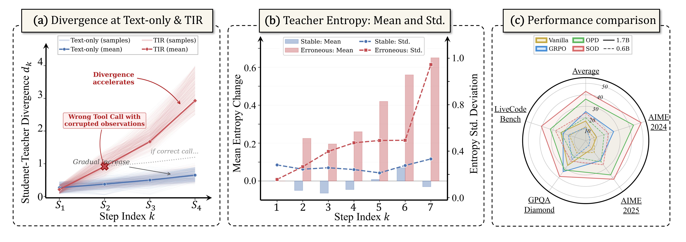
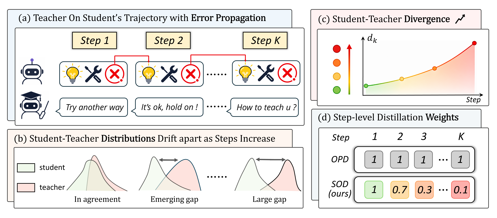

<div align="center">

<h2>SOD: Step-wise On-policy Distillation for<br>Small Language Model Agents</h2>

</div>

<p align="center">
  <a href="https://arxiv.org/abs/xxxx.xxxxx">
    
  </a>
  <a href="https://huggingface.co/collections/Gen-Verse/open-agentrl-68eda4c05755ca5a8c663656">
    
  </a>
</p>

## Introduction

<p align="center">
  
</p>

Applying On-Policy Distillation (OPD) to Tool-Integrated Reasoning (TIR) suffers from **cascading error propagation**: incorrect tool calls inject out-of-distribution observations that progressively amplify the student-teacher distribution shift, rendering the teacher's token-level supervision unreliable or even harmful.

**SOD (Step-wise On-policy Distillation)** addresses this by introducing an adaptive step-level weighting mechanism that:
- **Suppresses** distillation loss on steps where the student has drifted far from the teacher (erroneous pattern)
- **Restores** full supervision when the student recovers alignment (recovery pattern)
- **Maintains** dense token-level guidance on well-aligned steps (stable pattern)

All at **negligible additional computational cost** — the divergence metric reuses log-probabilities already computed in the OPD forward pass.

Experiments on challenging math, science, and code benchmarks show that SOD achieves up to **20.86%** improvement over the second-best baseline. **Notably, our 0.6B student achieves 26.13% on average@32 at AIME 2025.**

## Framework

<p align="center">
  
</p>

## 🚀 Get Started
### Environment Setup

```bash
git clone https://github.com/YoungZ365/SOD.git
conda create -n SOD python=3.11
conda activate SOD
cd SOD
bash scripts/install_vllm_sglang_mcore.sh
pip install -e .[vllm]
```

### Data Preparation

Download the following datasets:

| Dataset | Link | Usage |
|---------|------|-------|
| 3K Agentic SFT Data | [🤗 HuggingFace](https://huggingface.co/datasets/Gen-Verse/Open-AgentRL-SFT-3K) | Cold-start SFT |
| 30K Agentic RL Data | [🤗 HuggingFace](https://huggingface.co/datasets/Gen-Verse/Open-AgentRL-30K) | RL / Distillation Training |
| Evaluation Benchmarks | [🤗 HuggingFace](https://huggingface.co/datasets/Gen-Verse/Open-AgentRL-Eval) | AIME2024/2025, GPQA-Diamond, LiveCodeBench |

### Sandbox Configuration

Configure [SandboxFusion](https://github.com/bytedance/SandboxFusion) for code execution:

1. **Local Deployment**: Refer to [SandboxFusion deployment docs](https://bytedance.github.io/SandboxFusion/docs/docs/get-started#local-deployment)
2. **Cloud Service**: Use [Volcano Engine Code Sandbox](https://www.volcengine.com/docs/6662/1539235)

After obtaining an API endpoint, configure it in:
- `recipe/demystify/sandbox_fusion_tool_config.yaml`
- The function `check_correctness` in `verl/utils/reward_score/livecodebench/code_math.py`

## 🔧 Training

### Step 1: Cold-Start SFT

Configure `examples/SOD/run_sft.sh` with your paths:

- `MODEL_PATH`: Base model path (e.g., [Qwen3-1.7B](https://huggingface.co/Qwen/Qwen3-1.7B) or [Qwen3-0.6B](https://huggingface.co/Qwen/Qwen3-0.6B))
- `TRAIN_DATA`: Path to the SFT `.parquet` file
- `SAVE_PATH`: Directory to save SFT checkpoints

```bash
bash examples/SOD/run_sft.sh
```

After SFT, merge the model checkpoint:

```bash
python3 -m verl.model_merger merge --backend fsdp \
    --local_dir <checkpoint_dir>/global_step_xxx \
    --target_dir <checkpoint_dir>/global_step_xxx/huggingface
```

### Step 2: SOD Training (Step-wise On-policy Distillation)

Configure `examples/SOD/run_sod.sh` with your paths:

- `MODEL_PATH`: Path to the SFT student model
- `TEACHER_MODEL_PATH`: Path to the teacher model (e.g., a GRPO-trained 4B model)
- `TRAIN_DATA`: Path to the RL `.parquet` file (30K dataset)
- Evaluation data paths for AIME2024/2025

```bash
bash examples/SOD/run_sod.sh
```

**Training Resources**: 8× NVIDIA H20 96GB GPUs, batch size 64.

You can monitor training dynamics and evaluation results via Weights & Biases (wandb).

## 📊 Evaluation

We support evaluation on **AIME 2024/2025**, **GPQA-Diamond**, and **LiveCodeBench-v6**.

Taking AIME as an example:

```bash
bash examples/SOD/eval/run_eval_aime.sh
```

You can observe average@32 / pass@32 / maj@32 metrics from your wandb project.

## 📝 Citation

Coming soon.

## 🙏 Acknowledgements

Our implementation builds upon the excellent codebases of [VeRL](https://github.com/volcengine/verl), [Open-AgentRL](https://github.com/Gen-Verse/Open-AgentRL), and [ReTool](https://github.com/ReTool-RL/ReTool). We sincerely thank these projects for their valuable contributions to the community.
